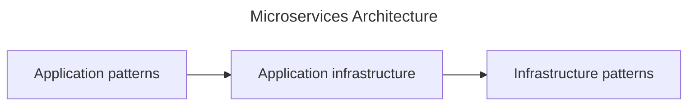
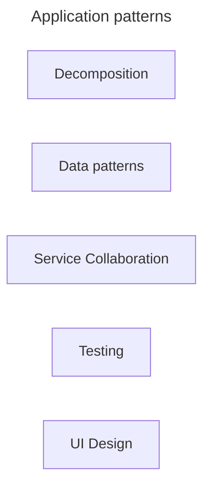
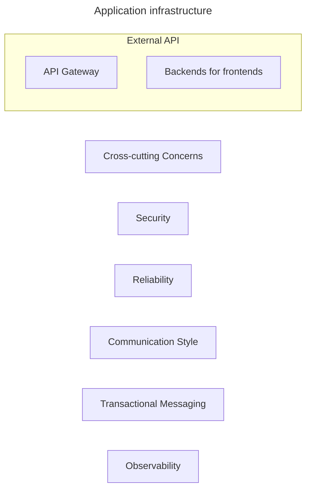
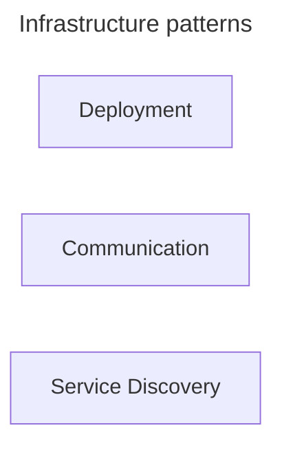
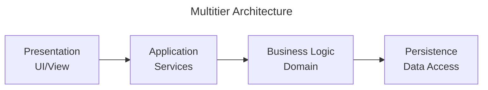
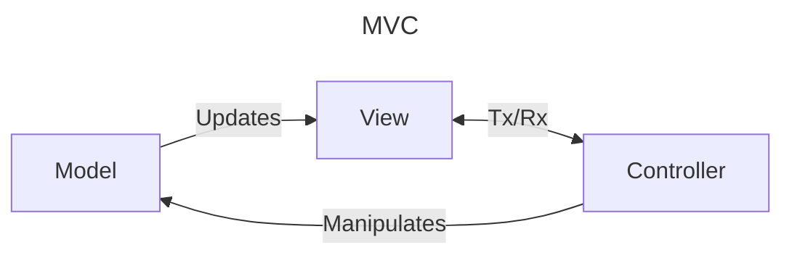
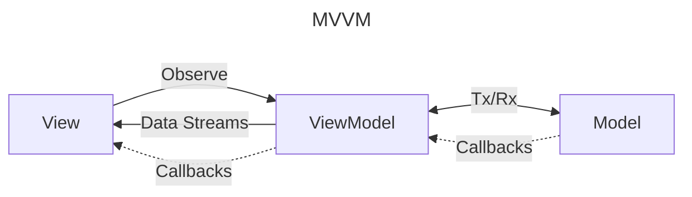

# Design Patterns for Microservices

This document summarizes key design patterns for microservices architecture.

---

## Architectural Style

### Monolithic Architecture
- Architect an application as a single deployable unit.

### Microservice Architecture
- Architect an application as a collection of independently deployable, loosely coupled services.

---

## Service Boundaries

### Decompose by Business Capability
- Define services aligned with business capabilities.

### Decompose by Subdomain
- Define services according to Domain-Driven Design (DDD) subdomains.

### Self-contained Service
- Design services to handle synchronous requests independently without waiting on others.

### Service per Team
- Assign each service to a dedicated team for ownership.

---

## Refactoring to Services

### Strangler Application
- Gradually replace parts of a monolithic application with microservices.

### Anti-corruption Layer
- Protect new microservices from legacy system models by translating between them.

---

## Service Collaboration

### Database per Service
- Each service owns its private database to enforce encapsulation.

### Shared Database
- Multiple services share a common database (generally discouraged).

### Saga
- Manage distributed transactions as a sequence of local transactions with compensating actions.

### Command-side Replica
- Maintain queryable replicas of command data for better performance.

### API Composition
- Implement queries by invoking multiple services and joining results in-memory.

### CQRS (Command Query Responsibility Segregation)
- Separate command and query models with materialized views for efficient querying.

### Domain Event
- Publish events whenever data changes to notify other services.

### Event Sourcing
- Persist state as a sequence of events rather than as a snapshot.

---

## Transactional Messaging

### Transactional Outbox
- Store messages in the same database as business data within a transaction to ensure consistency.

### Transaction Log Tailing
- Use the transaction log to publish messages asynchronously.

### Polling Publisher
- Poll a database table to publish messages to external systems.

---

## Testing

### Consumer-driven Contract Test
- Tests written by a service consumer to validate the provider's API.

### Consumer-side Contract Test
- Tests for service clients to verify communication correctness.

### Service Component Test
- Test a service in isolation using mocks or stubs for dependent services.

---

## Deployment

### Multiple Service Instances per Host
- Run multiple service instances on a single host.

### Service Instance per Host
- Deploy each service instance on a separate host.

### Service Instance per VM
- Deploy each service instance in its own virtual machine.

### Service Instance per Container
- Deploy each service instance in its own container.

### Serverless Deployment
- Use serverless platforms to deploy microservices.

### Service Deployment Platform
- Use a highly automated platform to deploy and manage services.

---

## Cross-cutting Concerns

### Microservice Chassis
- A framework handling common concerns like logging, configuration, and monitoring.

### Externalized Configuration
- Store configuration outside the service code for flexibility.

### Service Template
- A reusable template to quickly bootstrap new services with standard infrastructure.

---

## Communication Styles

### Remote Procedure Invocation (RPI)
- Use synchronous calls like REST or gRPC for inter-service communication.

### Messaging
- Use asynchronous message passing for loose coupling.

### Domain-specific Protocol
- Use protocols specific to the business domain.

### Idempotent Consumer
- Ensure consumers can handle repeated messages safely.

---

## External API

### API Gateway
- A single entry point that routes client requests to appropriate services.

### Backend for Frontend (BFF)
- Separate API gateways tailored for different client types.

---

## Service Discovery

### Client-side Discovery
- Clients query a service registry to find service instances.

### Server-side Discovery
- Routers or load balancers query the registry and route accordingly.

### Service Registry
- A database holding service instance locations.

### Self-registration
- Services register themselves with the registry on startup.

### 3rd Party Registration
- An external component registers services in the registry.

---

## Reliability

### Circuit Breaker
- Prevent cascading failures by failing fast when a remote service is unhealthy.

---

## Security

### Access Token
- Securely convey user identity and permissions between services.

---

## Observability

### Log Aggregation
- Collect logs in a centralized system.

### Application Metrics
- Instrument services to gather operational statistics.

### Audit Logging
- Record user actions for compliance and troubleshooting.

### Distributed Tracing
- Trace requests across service boundaries with unique identifiers.

### Exception Tracking
- Centralize exception reporting and alert developers.

### Health Check API
- Expose service health status for monitoring.

### Log Deployments and Changes
- Track deployments to aid in debugging.

---

## UI Design

### Server-side Page Fragment Composition
- Assemble UI pages on the server from fragments generated by multiple services.

### Client-side UI Composition
- Build UIs on the client by composing fragments from multiple services.

---

# Appendix

## Microservice Architecture Pattern Language

Microservice Architecture Pattern Language described at [microservices.io](https://microservices.io/patterns/index.html).

## Architecture

