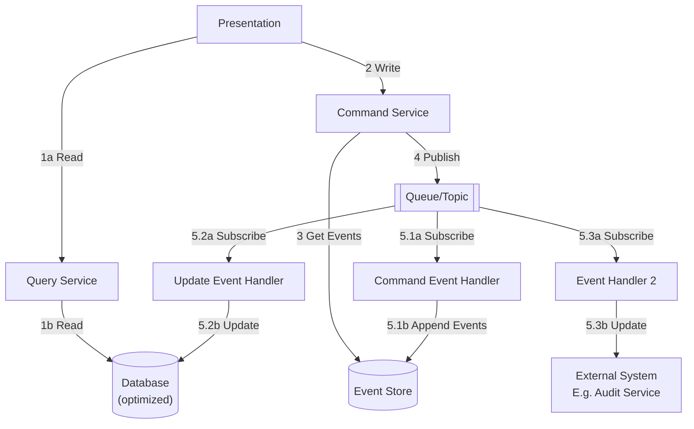

## Event Sourcing with CQRS

> Event-based messaging with Command Query Responsibility Segregation.

### Key Features
 * Strict separation of write (commands/events) and read (queries/projections).
 * Event store is the source of truth.
 * Event bus decouples event propagation.
 * Idempotency and replay are built-in.
