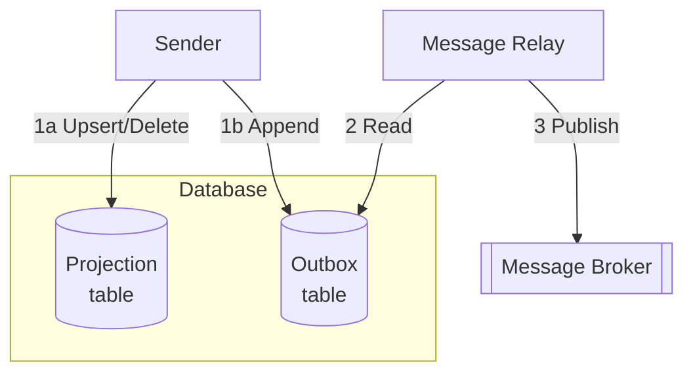

## Transactional Outbox

### Key Features
 * Sender writes event to an outbox table within the same transaction as the business entity.
 * Outbox table is polled, and events are published to the broker.
 * Reliable, avoids dual-write issues.
 * Simpler than full event sourcing, but no full event history.
